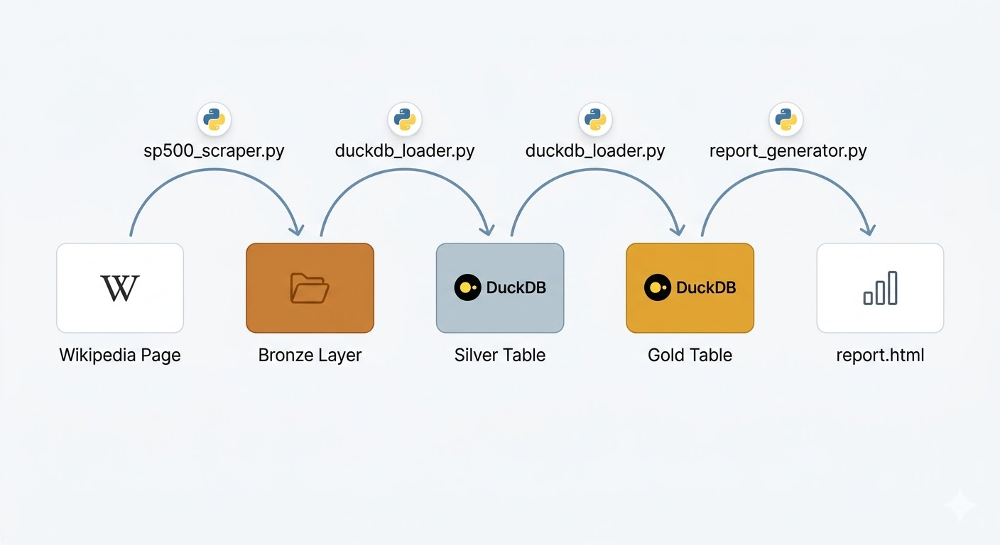

# Scraper Wikipedia – S&P 500

Ce projet extrait le tableau des **composantes du S&P 500** depuis :

https://en.wikipedia.org/wiki/List_of_S%26P_500_companies

Il repose sur une architecture orientée objet avec des responsabilités bien séparées.

## Architecture du projet



### Structure des fichiers

```
TP1_Wikipedia/
├── modele/
│   ├── __init__.py
│   └── sp500_company.py       # Dataclass SP500Company (modèle de données)
├── utils/
│   ├── __init__.py
│   ├── wikipedia_client.py    # Client HTTP — récupère le HTML de Wikipedia
│   ├── sp500_scraper.py       # Parseur — extrait les entreprises du tableau
│   ├── duckdb_loader.py       # Insère les données dans DuckDB
│   └── report_generator.py    # Génère le rapport HTML (Plotly)
├── data/
│   ├── sp500.duckdb           # Base de données DuckDB (généré automatiquement)
│   └── report.html            # Rapport HTML interactif (généré automatiquement)
├── .github/
│   └── workflows/
│       └── pipeline.yml       # CI/CD GitHub Actions (scraping + rapport + GitHub Pages)
├── main.py                    # Point d'entrée principal
└── requirements.txt
```

## Installation

```bash
pip install -r requirements.txt
```

## Exécution

Depuis le dossier `TP1_Wikipedia` :

```bash
python main.py
```

Fichiers de sortie générés dans `data/` :

- `data/sp500.duckdb` — base de données DuckDB contenant la table `sp500_companies`
- `data/report.html` — rapport HTML interactif avec graphiques Plotly

## Colonnes de la table DuckDB

| Colonne | Description |
|---|---|
| `symbol` | Symbole boursier (ex. AAPL) |
| `security` | Nom de l'entreprise |
| `gics_sector` | Secteur GICS |
| `gics_sub_industry` | Sous-secteur GICS |
| `headquarters_location` | Siège social |
| `date_added` | Date d'ajout au S&P 500 |
| `cik` | Identifiant SEC (CIK) |
| `founded` | Année de fondation |
| `scraped_at` | Horodatage de l'extraction (UTC) |
